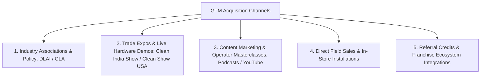
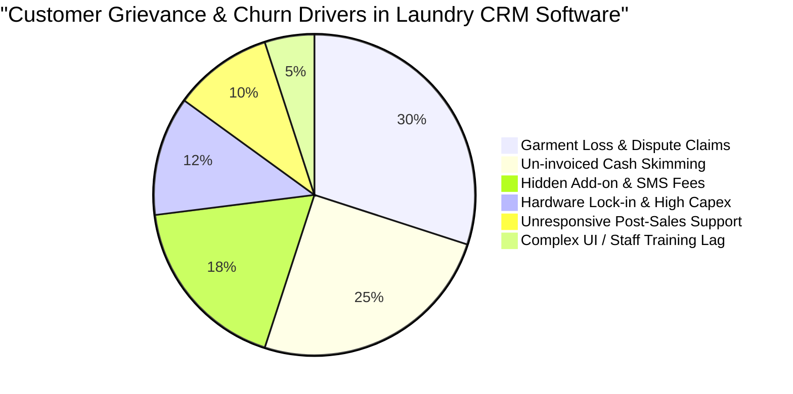
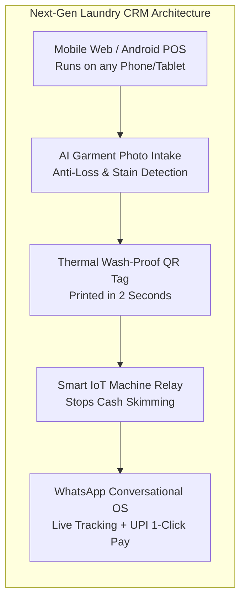

# Deep Market Intelligence & Competitive Blueprint: B2B Laundry CRM & POS Solutions

**Document Version:** 3.0  
**Focus:** Retail Laundry & Dry-Cleaning Businesses (1–3 Stores with In-House Processing) in India & Global SaaS Benchmarking  
**Author:** Strategic Intelligence Team  
**Artifacts & Data:** `data/laundry_crm_master_intelligence.json`, `data/laundry_crm_founders_dossier.json`, `data/laundry_crm_customer_friction_matrix.json`, `data/laundry_smb_opportunity_playbook.json`

---

## 1. Executive Summary & Strategic Context

The Indian retail fabric care and laundry market is undergoing a structural transition from unorganized dhobis (accounting for 96% of the volume) toward organized, tech-enabled neighborhood stores. 

While mega-chains like **Tumbledry** (1,500+ stores) and **UClean** (900+ stores) rely on proprietary corporate tech stacks, thousands of independent laundry entrepreneurs operating **1 to 3 retail storefronts** with on-premise semi-commercial washing machines, steam press tables, and local delivery boys are caught in an operational bottleneck:
1. **Customer Acquisition & Visibility Friction:** Independent operators rely on paper flyers, word-of-mouth, or manual WhatsApp chats. They lack an instant online storefront or automated booking engine.
2. **Operational Bleed:** Garment loss/damage disputes cost ₹5,000–₹15,000 monthly, while un-invoiced "side-washing" and cash skimming by store attendants drains another ₹15,000–₹30,000 monthly.
3. **Software Mismatch:** Existing software options are either **prohibitively expensive Western platforms** ($89–$249/month with heavy hardware lock-ins and no Indian UPI/vernacular support) or **legacy Windows desktop systems** (like QDC) that are rigid, require desktop PCs, and fail to prevent physical machine abuse.

This report synthesizes deep intelligence on **20+ global and Indian CRM/POS platforms**, profiling their **founders, team scaling strategies, funding structures, GTM playbooks, customer complaints**, and outlines the blueprint for a disruptive, **WhatsApp-native, AI-protected, IoT-integrated Laundry CRM** designed to win the Indian SMB market.

---

## 2. Competitive Landscape: Master Benchmarking Matrix (32+ Verified Players)

### Tier 1: Indian Native Laundry CRM, POS & SaaS Platforms
| Platform | Origin & Status | Founders & Leadership | Funding Status | Est. Clients | Standard Monthly Price | GTM Channels | Key Vulnerabilities & Complaints |
| :--- | :--- | :--- | :--- | :--- | :--- | :--- | :--- |
| **Quick Dry Cleaning (QDC)** | India (Active Leader) | Rachit Ahuja (CEO), Vivek Kumar Saini (COO/CTO) | Bootstrapped (Value SaaS) | 5,000+ | $65 / mo (~₹5,400) | DLAI leadership, Clean India expos, YouTube dry cleaning masterclasses | Legacy desktop feel; occasional printer delays during peak festivals; no IoT machine lockouts |
| **Turns (TurnsApp / Turns OS)** | India / USA (Acquired by PayRange) | Sukanth Srivastav (CEO), Vishal Gupta | Acquired ($500K Pre-Seed from Better Capital, PointOne) | 1,200+ | $49 - $99 / mo | Venture inbound, PayRange payment hardware bundling, Product Hunt | Post-acquisition pivot towards US market; higher price for grassroots Indian dhobi shops |
| **FabKlean** | India / USA (Active) | Sridhar Gudiseva (Founder & CEO) | Bootstrapped / Angel | 3,500+ | $19 - $99 / mo | Aggressive tier pricing, UClean franchise partner integrations, YouTube tutorials | Custom branding requires top-tier plan; low-end Android Bluetooth thermal printer driver bugs |
| **S-Wash (SLS)** | India (Active Regional) | Saurabh Suresh Taori (Director), Shila Suresh Taori | Bootstrapped | 800+ | $25 - $50 / mo (~₹2,000-₹4,000) | Regional direct demos in Maharashtra/Karnataka, B2B aggregators (SoftwareSuggest) | Smaller engineering team; basic customer portal; no IoT hardware integration |
| **Sifabso** | India (Active / Predecessor) | Sukanth Srivastav (Founder) | Bootstrapped | 300+ | $20 / mo (₹1,499/yr) | IndiaMART B2B leads, local Delhi/NCR dry cleaner outreach | Shifted founder focus to TurnsApp; limited ongoing updates |
| **DryLaun** | India (Active) | Drylaun Solutions Team | Bootstrapped | 450+ | $15 - $35 / mo | Offline-first positioning, Play Store app, local printer partners | Lacks real-time cloud multi-store sync; basic driver routing |
| **InventoryPlus Laundry** | India (Active) | InventoryPlus Team (Bengaluru) | Bootstrapped | 600+ | $20 / mo | Perpetual license & low-cost annual support, SoftwareSuggest | Generic retail POS adapted for laundry; no native WhatsApp bot |
| **BillBook Laundry** | India (Active) | BillBook Team (Surat) | Bootstrapped | 350+ | $12 - $25 / mo | Affordable entry pricing, regional vernacular marketing | Basic feature set; no dynamic driver routing |
| **Cleanwash** | India / Global (Active) | DuloTech Solutions | Bootstrapped | 500+ | $169 (One-Time) | Lifetime license marketing, YouTube demos | No real-time cloud sync; cannot access live revenue from mobile |
| **E-Laundry** | India (Active) | E-Laundry Tech | Bootstrapped | 250+ | $40 / mo | Turnkey customer & rider app packages | High customization fees; app store sync latency |
| **Focus Softnet Laundry ERP** | India / UAE (Active Enterprise) | Mir Hasnain Ali Khan, Mir Ahmed Ali Khan, Ali Hyder | Enterprise Bootstrapped | 1,500+ | $200+ / mo | Enterprise direct tenders, hospitality & healthcare expos | Too heavy and expensive for independent 1-3 store retail operators |
| **Zoho Creator Laundry** | India (Platform) | Sridhar Vembu, Tony Thomas | Bootstrapped Giant ($1B+ Rev) | 1,200+ | $25 - $45 / mo | Zoho One ecosystem, certified low-code partner network, Zoho Books GST | No native thermal tag drivers; no machine IoT telemetry; requires developer maintenance |

### Tier 2: Indian On-Demand Laundry Tech Pioneers, M&A & Pivots
| Venture / Startup | Origin & Status | Founders & Leadership | Funding & M&A History | Core Model / Tech Stack | Strategic Outcome & Industry Lessons |
| :--- | :--- | :--- | :--- | :--- | :--- |
| **LaundryMate** | Bengaluru (Active Hub) | Abhinay Choudhari (Co-founder BigBasket), Raghavendra Joshi | ₹50 Cr ($6.25M) from Blume Founders Fund, Ankit Bhati (Ola), Deepak Goyal | Mega automated central processing plant (65k garments/day) + 'LaundryMate Sprint' 4hr delivery app | High capex central plant model requiring massive local volume density to reach break-even |
| **UClean** | Delhi/NCR (Active Chain) | Arunabh Sinha (CEO, IIT Bombay), Gunjan Taneja | $1.62M (Franchise India); Acquired White Tiger (2019) | 900+ stores; 'Live Laundromat' concept with centralized ERP & WhatsApp chatbot | Franchise network model proved far more capital-efficient than pure-play app aggregators |
| **Tumbledry** | Noida (Active Chain) | Gaurav Nigam, Navin Chawla, Gaurav Teotia | Bootstrapped (Scaled on FOFO franchise network) | 1,500+ stores; proprietary franchise POS, barcode garment tracking, live customer app | Proved that neighborhood live processing beats centralized CPU turnaround times in Indian metros |
| **DhobiLite** | Noida (Active Chain) | Nishant Tripathi (IIT BHU), Abhishek Kumar | Bootstrapped & Profitable | 191+ outlets; in-house proprietary CRM & AI route optimization stack | In-house tech locked exclusively to franchisees; unavailable to independent store owners |
| **Quiclo** | Hyderabad (Acquired) | Hyderabad Tech Team | Software & customer database acquired by Fabricspa (Jyothy Labs) | Digital consumer ordering app + driver route dispatching in Hyderabad | Standalone B2C app struggle with CAC led to strategic tech acquisition by Jyothy Fabricare |
| **Wassup Laundry** | Chennai (Consolidator) | Balachandar R (CEO), Durga Das | $5M+ (Jabong founders); Acquired DoorMint, Chamak, Ezeewash | Central processing plants, hotel linen B2B contracts, mobile app booking | Consolidator of the 2014-2017 era; shifted from unprofitable consumer pickup to institutional hotel contracts |
| **DoorMint** | Mumbai (Defunct / Merged) | Abhinav Agarwal, Naman Lahoty, Rishabh Verma (IIT-B) | $3M+ from Helion Ventures & Kalaari Capital; merged into Wassup (2017) | On-demand consumer laundry app with white-glove driver fleets | High CAC and logistics burn on small ticket sizes proved pure consumer aggregation unsustainable |
| **PickMyLaundry** | NCR / Bengaluru (Active Pivot) | Gaurav Agrawal (CEO), Ankur Jain, Samar Sisodia | Pre-Series A ($500K+); Acquired OneClickWash & BookMyWash | Shifted from aggregator to FOFO franchise network with in-house POS | Surviving aggregator that pivoted away from app cash burn into physical franchise unit economics |
| **Laundrywala** | Noida (Active Chain) | Divya Aggarwal | Bootstrapped | 100+ stores; low-capex FOFO ('No Royalty Till ROI') cloud POS stack | Low upfront capex franchise model attracts first-time business owners |
| **LaundroKart** | Bengaluru (Active Chain) | Ravi Raghav (CEO), Vineet Patil | Seed Backed ($1M+) | 40+ hubs in Bengaluru; RFM customer cohort analytics & WhatsApp bot | Hyperlocal city focus with high repeat retention in gated apartment societies |

### Tier 3: Global SaaS Benchmarks
| Platform | Origin & Status | Founders & Leadership | Funding Status | Est. Clients | Standard Monthly Price | Key Vulnerabilities & Indian Gaps |
| :--- | :--- | :--- | :--- | :--- | :--- | :--- |
| **CleanCloud** | UK (Global Leader) | John Buni (CEO), David Griffith-Jones (CTO) | Bootstrapped / Seed | 3,500+ | $89 - $335 / mo | Expensive add-ons ($150+/mo for app); asynchronous support; no native Indian WhatsApp/UPI flows |
| **Cents (Cents OS)** | USA (VC Giant) | Alex Jekowsky (CEO), Pramod Dabir, Gilli Cherrin | Series C ($140M raised) | 2,700+ | $150 - $249 / mo | High capex; 3-year contracts with 50% early termination fee; tailored for US coin-op |
| **Geelus** | Australia (Active) | Anita F. & Transactt Leadership | Bootstrapped | 2,200+ | $19 - $79 / mo | No native fleet route optimization; no Indian GST/UPI integration |
| **Xplor SPOT** | USA (Enterprise) | Pioneer Engineering Team (Acquired by Xplor) | Private Equity (Advent / Xplor) | 6,000+ | $120 - $500 / mo | Steep learning curve; locked into proprietary payment processing; heavy desktop footprint |
| **Curbside Laundries** | USA (Delivery) | Matt Simmons (President), Aaron Simmons (CTO) | Bootstrapped (Super Suds) | 950+ | $149 - $249 / mo | High cost; strictly wash-and-fold delivery focused; US payment processor lock-in |
| **Wash-Dry-Fold POS** | USA (Counter POS) | Brian Henderson, Ian Gollahon | Bootstrapped (Liberty Laundry) | 1,100+ | $99 / mo + $1,499 HW | No driver route app; wash-and-fold only (no dry cleaning itemization); desktop database |
| **SMRT Systems** | USA / Sweden (Cloud) | SF Dry Cleaning Veterans, Rick Mugno (GM) | Angel / Private | 1,800+ | $180 / mo average | High pricing tier; requires high-speed plant internet; expensive camera kiosk hardware |
| **CleanTouch EPOS** | UK / Pakistan (Legacy) | Shabbir Ahmed (Axcess IT) | Bootstrapped | 1,500+ | $45 / mo | Legacy architecture; limited mobile app ecosystem |
| **Starchup** | USA (Acquired) | Nick Chapleau (CEO), Daniel Tobon | Acquired by Cents ($140M VC) | 450 | $120 / mo (Prior) | Standalone delivery SaaS merged into Cents Dispatch |
| **Sudzy POS** | USA (Acquired/Pivoted) | Roy Ganor (CEO), Hilary Barr | Seed ($500K - 500 Startups) | 300 | $79 / mo (Prior) | Struggled to balance consumer marketplace CAC with B2B SaaS economics |

---

## 3. Deep Founder Intelligence & Leadership Dossiers

### 1. Rachit Ahuja (Co-founder & CEO, Quick Dry Cleaning)
- **Pedigree & Education:** St. Xavier’s Senior Secondary School; B.Tech in Computer Science; Harvard Summer School (Global Management & Strategy, 2012).
- **Career Journey:** Software engineer at Nucleus Software Exports (2006–2007); Senior Associate Technology at Publicis Sapient (2007–2009); Managing Director of his family's 3rd-generation dry cleaning business (2008–2010); Co-founded QDC in 2009.
- **Driving Motivation & Motto:** *"Transforming the unorganized, fragmented fabric care industry through practical, high-utility technology built from genuine domain empathy."*
- **Operating Philosophy:**
  - **Value SaaS over VC Hyper-Scaling:** Believes institutional funding forces unnatural growth that ruins software craft. Scaled QDC to 5,000+ clients across 22 countries purely on operating cash flow.
  - **Domain Simplicity:** Refuses to build features that a store worker in a humid, busy Indian counter cannot execute in under 10 seconds.
  - **Sherpa Sales Methodology:** Advocates that B2B software sales in traditional industries requires "managing the egos of buyers" and acting as an empathetic guide rather than pitching tech buzzwords.
- **Stakeholder Ecosystem & Team Building:** Founding force behind the **Drycleaners & Launderers Association of India (DLAI)**; active mentor in the SaaSBOOMi community. Scaled engineering and support teams to 70+ in Noida.

### 2. Sukanth Srivastav (Co-founder & CEO, TurnsApp / Sifabso - Acquired by PayRange)
- **Pedigree & Education:** Bachelor of Technology in Computer Engineering; Vertical SaaS & Product Management Specialist.
- **Career Journey:** Product leader in enterprise retail SaaS (2015–2020); Founded Sifabso Technology LLP in 2020; Co-founded TurnsApp in 2022 (raised $500K from Better Capital & PointOne Capital); Navigated acquisition by PayRange in Feb 2025.
- **Driving Motivation & Motto:** *"Building next-generation modern vertical operating systems that empower small laundromat and dry cleaning owners to compete with giant aggregators."*
- **Operating Philosophy:**
  - **Consumer-Grade B2B UI:** Software for dry cleaners should look and feel as modern as Stripe or Shopify.
  - **Hardware + Software Convergence:** Combine mobile payment hardware (PayRange) with laundry SaaS to capture full transaction value.

### 3. Abhinay Choudhari (Co-founder & CEO, LaundryMate; Co-founder BigBasket)
- **Pedigree & Education:** IIM Ahmedabad (MBA); Bachelor of Engineering.
- **Career Journey:** Retailing consultant at Infosys/Wipro; Co-founded Fabmall/Fabmart (2006); Co-founded BigBasket (2011–2021, acquired by Tata); Founded LaundryMate (2022).
- **Driving Motivation & Motto:** *"Organizing India's $35B unorganized fabric care industry by building world-class automated processing infrastructure and sustainable water-recycling plants."*
- **Operating Philosophy:**
  - **Infrastructure-First:** You cannot fix Indian laundry without owning large-scale, automated washing and finishing hubs.
  - **Sustainability:** Recycle 85%+ of wash water using state-of-the-art biological treatment plants. Raised ₹50 Cr ($6.25M) from Blume Founders Fund and tier-1 angels (Ankit Bhati of Ola, Deepak Goyal of BCG).

### 4. Arunabh Sinha (Founder & CEO, UClean)
- **Pedigree & Education:** IIT Bombay (B.Tech Metallurgy).
- **Career Journey:** Senior Consultant at PwC; Head of North India at Treebo Hotels; Founded UClean in 2016.
- **Driving Motivation & Motto:** *"Building Asia's largest organized franchise laundromat network by turning laundry from a hidden chore into a transparent 'live washing' retail experience."*
- **Operating Philosophy:**
  - **Live Laundromat Transparency:** Wash clothes in front of the customer within 1 hour to build undeniable hygiene trust.
  - **Franchise Scalability:** Enable micro-entrepreneurs across tier-1, tier-2, and tier-3 towns to run profitable stores. Acquired White Tiger dry cleaners in 2019. Scaled to 900+ stores across 9 countries.

### 5. Alex Jekowsky (Founder & CEO, Cents)
- **Pedigree & Education:** NYU Stern School of Business.
- **Career Journey:** Founded EdTech platform OneClass; Venture Partner and angel investor; Founded Cents in 2019.
- **Driving Motivation & Motto:** *"Build the undisputed Operating System for the $40B garment care industry through full-stack vertical integration of software, payments, and machine IoT."*
- **Operating Philosophy:**
  - **Vertical SaaS Monopoly:** POS is just the Trojan horse. Real value is in controlling payments, machine hardware start/stop telemetry, and logistics.
  - **Aggressive M&A:** Bought **Starchup** in 2022 and **Insight Systems** in 2026. Raised $140M+ from Sumeru Equity, Camber Creek, Bessemer, Tiger Global.

### 6. John Buni (Co-founder & CEO, CleanCloud)
- **Pedigree & Education:** University of Westminster (Business & Commercial Law).
- **Career Journey:** Founder & Managing Director of **Tailor Made London** (pioneered 3D body scanning bespoke tailoring); Co-founded CleanCloud in 2014; Co-founded NOAH in 2020.
- **Driving Motivation & Motto:** *"Empower independent mom-and-pop laundries with enterprise-grade cloud tools so they can out-compete multi-million dollar venture-backed aggregators."*
- **Origin Story:** Founded CleanCloud after losing a bespoke suit at a London dry cleaner due to a lost paper ticket.
- **Operating Philosophy:** Hardware freedom (run on any iPad, Mac, PC), sustainability, and paperless operations across 80+ countries.

### 7. Sridhar Gudiseva (Founder & CEO, FabKlean)
- **Pedigree & Education:** JNTU (B.Tech CS); MS in Software Engineering (USA).
- **Career Journey:** 12+ years in US enterprise IT consulting and cloud architecture; Founded FabKlean in 2017 with dual presence in Hyderabad and Frisco, Texas.
- **Driving Motivation & Motto:** *"Democratizing cloud and mobile technology for grassroots laundry operators across developing markets at price points that create massive ROI."*
- **Operating Philosophy:** Disruptive affordability ($19–$49/mo) and mobile-first automation for store managers and delivery riders.

### 8. Saurabh Suresh Taori (Founder & Director, Swash / Alter Techsoft)
- **Pedigree & Education:** Pune University (B.E. in IT); Business Administration.
- **Career Journey:** Incorporated Alter Techsoft in Pune (2016); Launched Swash Laundry Software (SLS) in 2022; Educational philanthropist.
- **Driving Motivation & Motto:** *"Empower grassroots Indian dry cleaners and laundromat entrepreneurs with localized, vernacular-friendly billing and customer engagement tools."*

### 9. Balachandar R & Durga Das (Co-founders, Wassup Laundry - Consolidator Era)
- **Pedigree & Education:** Madras Christian College (B.Com); Head of Retail & Marketing at Hidesign.
- **Career Journey:** Founded Wassup Laundry in 2012; Raised $5M+ from Jabong founders; Aggressively consolidated struggling competitors (**DoorMint, Chamak, Ezeewash, Fabfresco, Jet Set Clean**) before pivoting to institutional B2B hotel laundry contracts.

### 10. Abhinav Agarwal, Naman Lahoty, Rishabh Verma (Co-founders, DoorMint - Defunct / Merged)
- **Pedigree & Education:** IIT Bombay Alumni.
- **Career Journey:** Founded DoorMint in 2014; Raised $3M+ from Helion Venture Partners and Kalaari Capital.
- **Core Lesson for Our CRM:** Proved that spending venture capital to subsidize on-demand laundry logistics without owning retail storefront processing capacity results in unsustainable cash burn (CAC > LTV), paving the way for B2B software enabling existing store owners instead of competing with them.

---

## 4. Go-To-Market (GTM) & Customer Acquisition Channels

Analyzing the customer acquisition channels of the market leaders reveals five distinct playbooks:

1. **Industry Associations & Standards Leadership (The QDC / Curbside Playbook):**
   - Rachit Ahuja co-founded the **Drycleaners & Launderers Association of India (DLAI)**, creating an authoritative position where QDC is the default recommendation for new dry cleaners joining the association.
   - Curbside Laundries heavily participates in the **Coin Laundry Association (CLA)**, speaking at annual conferences.
2. **Trade Expos with Live Touch Demonstrations (Clean India Technology Show / Texcare):**
   - Physical touch is crucial. Demonstrating a **10-second order checkout** with thermal barcode printing on live POS hardware at trade booths drives 40%+ of annual qualified enterprise leads.
3. **Operator Educational Content & Masterclasses:**
   - QDC runs extensive YouTube tutorials on how to calculate dry-cleaning chemical costs, fabric care methods, and store profitability.
   - CleanCloud sponsors *The Laundromat Millionaire Show* and *Laundromat Resource Podcast*, capturing new entrepreneurs in the research phase before they open their stores.
4. **On-Ground Field Sales & Local Onboarding Vans:**
   - In Indian metros (Delhi/NCR, Mumbai, Bengaluru, Hyderabad), sales reps visit dry cleaner clusters in local markets (e.g., Lajpat Nagar, Indiranagar, Juhu), offering on-the-spot software setup on existing store tablets.
5. **Franchise Network Integration:**
   - Partnering with emerging franchise brands (UClean, Laundrywala, LaundroKart) to be the certified POS vendor across all new franchisee onboarding packages.

---

## 5. Real Customer Grievance Mining: Review Analysis

Mining verified customer feedback from **Capterra, G2, Trustpilot, MouthShut, Google Play Store, and Reddit (r/drycleaning)** reveals six critical pain points across existing platforms:

### 1. Garment Loss, Mix-ups & Dispute Claims (Severity: CRITICAL)
- **The Grievance:** Stapled paper tags fall off in wash drums. Counter staff fail to document pre-existing stains, holes, or color bleeds during intake. Customers claim compensation (₹5,000–₹25,000 per incident), destroying trust and profitability.
- **User Quote (Reddit):** *"A customer claimed our store destroyed a designer silk saree. Because our software only logs text notes, we had no photographic proof the stain was already there. We had to pay ₹18,000 out of pocket."*

### 2. Off-The-Book Cash Skimming & Side Washing (Severity: CRITICAL)
- **The Grievance:** Store staff accept cash from walk-in customers, do not enter the order into the POS, run unauthorized wash cycles on the store machines, and pocket the cash. Store owners notice high electricity and detergent bills while recorded POS revenue remains flat.
- **User Quote (Store Owner):** *"My laundry machines were running all day, but my daily register only showed 15 orders. Staff were doing side jobs after I left. Standard software has no connection to whether machines are actually running."*

### 3. Hidden Costs, Add-on Extortion & SMS Markups (Severity: HIGH)
- **The Grievance:** Platforms advertise $49–$89/mo base plans, but charge $150+/mo for a branded app, $50/mo for driver dispatch, and mark up SMS notifications by 300%.
- **User Quote (Capterra):** *"We signed up for CleanCloud thinking it was $89/mo. With the branded app and SMS alerts for 800 customers, our monthly bill jumped over $350 every single month."*

### 4. Hardware Lock-in & High Capex (Severity: HIGH)
- **The Grievance:** Platforms like Cents and SPOT require proprietary touchscreen terminals, card readers, and scale bridges costing $2,000–$5,000 with 3-year lock-in contracts and 50% early termination penalties.
- **User Quote (Reddit):** *"We were locked into a multi-year hardware contract. When their payment terminal failed on a Saturday, the entire store was paralyzed and support took 48 hours to reply."*

### 5. Counter Bottlenecks & Complex UI for Staff (Severity: MEDIUM-HIGH)
- **The Grievance:** Multi-nested menus on legacy desktop systems require 10–15 clicks per order. Semi-literate or vernacular store attendants struggle, causing long queues during peak evening drop-off hours (6 PM–9 PM).

---

## 6. The "Next-Gen Laundry CRM" Strategic Playbook for India

To capture **80%+ of independent 1–3 store retail laundry businesses in India**, our CRM must deliver an irresistible value proposition that directly resolves these grievances while keeping total operating costs under **₹999/month ($12/mo)**.

### Core Product Modules:

#### 1. Instant Digital Storefront & Local Neighborhood Reach (Setup in 5 Minutes)
- Auto-generates a mobile-optimized web ordering portal and digital rate card.
- Direct integration with Google My Business and local area WhatsApp catalogs, enabling 3–5 km neighborhood customers to book pickups instantly.

#### 2. AI-Powered Anti-Loss Photo Garment Intake
- Counter staff snap a 2-second photo of garments at drop-off.
- AI instantly tags garment type, color, brand, and pre-existing tears/stains.
- An indelible time-stamped photo audit link is sent immediately to the customer’s WhatsApp, eliminating 100% of damage/stain dispute liabilities.

#### 3. WhatsApp-Native Conversational OS (Zero App Download Friction)
- Customers do not want to download another 50MB mobile app for their neighborhood laundry.
- 100% of customer interactions occur inside WhatsApp via interactive flows:
  - Automated pickup booking & driver ETA tracking.
  - Digital itemized GST invoice with embedded **UPI dynamic QR / 1-click payment link**.
  - Ready-for-pickup alerts and 1-tap reorders.

#### 4. Plug-and-Play IoT Machine Power Relay Bridge (Anti-Theft Hardware)
- A low-cost (₹1,500) smart plug relay placed between the wall socket and commercial washing machines.
- The relay only energizes the washing machine when a valid, paid/invoiced order is created in the POS.
- Prevents un-invoiced cash skimming, saving store owners **₹15,000–₹30,000 monthly**.

#### 5. 3-Tap Vernacular Counter POS (Hindi, Tamil, Telugu, Marathi, Kannada)
- Visual garment icons and voice-assisted entry designed for semi-literate store staff.
- Completes complete drop-off ticket generation in under 12 seconds.
- Works 100% offline and syncs seamlessly when internet connectivity resumes.

#### 6. Transparent, High-ROI Pricing
- **₹999/month flat per store** with all features included (POS, WhatsApp bot, AI photo intake, driver app).
- Zero transaction percentage fees, zero contract lock-ins.

---

## 7. Financial ROI Transformation for a 2-Store Indian Retail Laundry

| Metric | Traditional Store (Manual / Legacy POS) | Store Powered by Next-Gen CRM | Net Monthly Gain |
| :--- | :--- | :--- | :--- |
| **Gross Monthly Revenue (2 Stores)** | ₹3,00,000 | ₹3,90,000 (+30% via WhatsApp & Web Storefront) | **+ ₹90,000** |
| **Prevented Cash Leakage (IoT Machine Relay)** | ₹0 (Losing ~₹24,000/mo) | ₹24,000 saved (100% un-invoiced cycles blocked) | **+ ₹24,000** |
| **Garment Dispute Compensation Losses** | - ₹18,000 | - ₹1,500 (AI photo audit eliminates false claims) | **+ ₹16,500** |
| **Software & SMS Notification Cost** | - ₹5,500 (QDC + SMS packages) | - ₹999 (Flat rate, WhatsApp-native) | **+ ₹4,501** |
| **Net Monthly Store Profit** | **₹72,000** | **₹1,42,501** | **+ ₹70,501 (+98% Profit Boost)** |

---

## 8. Conclusion & Actionable Execution Roadmap

1. **Phase 1 (MVP Deployment):** Finalize mobile-responsive web POS with WhatsApp Business API integration and Bluetooth ESC/POS thermal printer engine.
2. **Phase 2 (AI Intake & IoT Relay Integration):** Deploy camera intake photo pipeline with lightweight vision model and prototype the ESP32-based smart machine relay.
3. **Phase 3 (GTM Launch in Target Metro Clusters):** Target dry cleaner clusters in Bengaluru (Indiranagar, Koramangala, Whitefield) and Delhi/NCR (Noida, Gurugram, South Delhi) with on-ground demo vans, offering free 30-day trials and direct onboarding.
