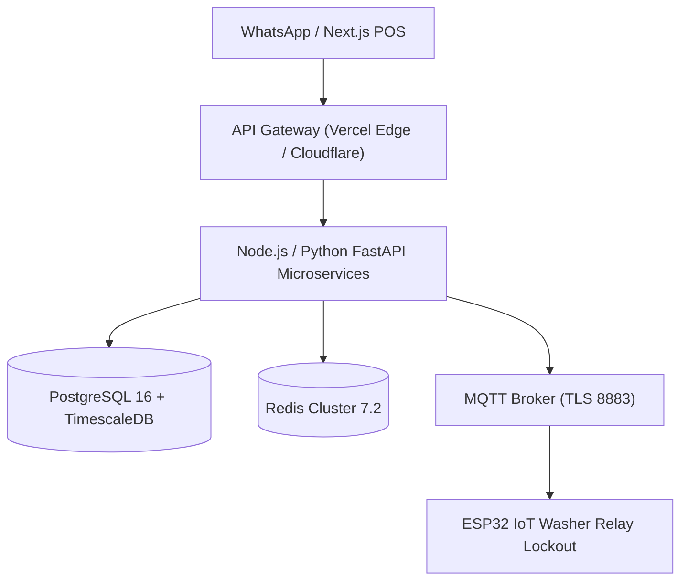

# OKF Concept: System Architecture & Technical Specifications
**Domain:** Software & Hardware Infrastructure  
**Specification:** Google OKF v0.2  

---

## 1. Core Component Stack



---

## 2. PostgreSQL ER Schema

```sql
CREATE TABLE stores (
    id UUID PRIMARY KEY DEFAULT gen_random_uuid(),
    company_name VARCHAR(255) NOT NULL,
    franchise_type VARCHAR(50),
    royalty_rate_pct DECIMAL(4,2),
    created_at TIMESTAMP DEFAULT CURRENT_TIMESTAMP
);

CREATE TABLE orders (
    id UUID PRIMARY KEY DEFAULT gen_random_uuid(),
    store_id UUID REFERENCES stores(id),
    customer_phone VARCHAR(20),
    status VARCHAR(50),
    total_amount_inr DECIMAL(10,2),
    ai_defect_photos JSONB,
    created_at TIMESTAMP DEFAULT CURRENT_TIMESTAMP
);
```
