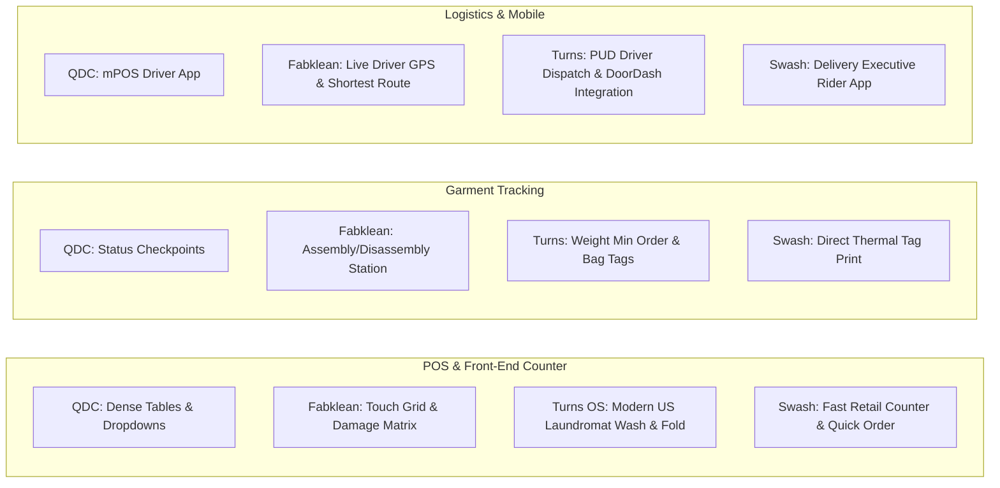

# Comprehensive Work Log: Multi-Competitor Laundry CRM Market Intelligence Pipeline

**Project**: Empirical Competitive Research & Automated UI Reverse-Engineering  
**Subproject Directory**: `tools/video_pipeline`  
**Competitors Analyzed**:
1. **Quick Dry Cleaning (QDC)**: `data/raw/qdc` (9 module playlists, 168 analyzed videos, 2,049 screens)
2. **Fabklean**: `data/raw/fabklean` (Complete POS & Billing System, 1 analyzed video, 138 screens)
3. **Turns OS (Sifabso)**: `data/raw/turns` (5 module playlists, 12 analyzed videos, 352 screens)
4. **Swash Laundry Software (SLS)**: `data/raw/swash` (9 module playlists, 111 analyzed videos, 1,238 screens)  
**Date**: September 8, 2026  

---

## 1. Executive Summary & Full Repository Metrics

Across all 4 target competitors and 24 distinct product playlists, **3,777 full-resolution UI screens** have been extracted, perceptual scene-classified, timestamped, and cataloged alongside machine-readable metadata (`analysis.json`) and rich Markdown documentation (`analysis.md`):

```
========================================================================================================
                               COMPETITIVE INTELLIGENCE DATASET MATRIX
========================================================================================================
Competitor                 | Playlists / Modules | Cataloged | Analyzed | Screens Captured | Offline | Index Location
--------------------------------------------------------------------------------------------------------
Quick Dry Cleaning (QDC)   | 9 Playlists         | 218       | 168      | 2,049            | 50      | data/raw/qdc/MASTER_INDEX.md
Fabklean                   | Full Deep-Dive (46m)| 1         | 1        | 138              | 0       | data/raw/fabklean/ui_timeline.md
Turns OS (Sifabso)         | 5 Playlists         | 13        | 12       | 352              | 1       | data/raw/turns/MASTER_INDEX.md
Swash Laundry Software     | 9 Playlists         | 133       | 111      | 1,238            | 22      | data/raw/swash/MASTER_INDEX.md
--------------------------------------------------------------------------------------------------------
GRAND TOTAL                | 24 Product Modules  | 365       | 292      | 3,777            | 73      | -
========================================================================================================
```

---

## 2. Competitive Breakdown by Platform

### 2.1 Quick Dry Cleaning (QDC) — `data/raw/qdc`
- **Master Index**: [`data/raw/qdc/MASTER_INDEX.md`](data/raw/qdc/MASTER_INDEX.md)
- **Playlists Captured (9)**:
  1. `data/raw/qdc/` — Core CRM Setup & Master Configuration (129 analyzed, 1,423 screens)
  2. `data/raw/qdc/mpos_rider/` — QDC MPOS Delivery Rider App (7 analyzed, 76 screens)
  3. `data/raw/qdc/client_reviews/` — Live Production Store Deployments (10 analyzed, 144 screens)
  4. `data/raw/qdc/referrals/` — Referral Policies & Customer Wallets (4 analyzed, 89 screens)
  5. `data/raw/qdc/on_demand_app/` — On Demand Mobile Web Ordering (1 analyzed, 18 screens)
  6. `data/raw/qdc/attendance_management/` — Staff Attendance & Payroll (2 analyzed, 34 screens)
  7. `data/raw/qdc/coupons/` — Promotional Coupon Generation & App Redemption (6 analyzed, 88 screens)
  8. `data/raw/qdc/schedule_pickups/` — Website Pickup Booking Widget & Buttons (6 analyzed, 112 screens)
  9. `data/raw/qdc/qdc_101/` — Barcode Tagging & Pilferage Prevention (3 analyzed, 65 screens)

### 2.2 Fabklean — `data/raw/fabklean`
- **Master Timeline**: [`data/raw/fabklean/ui_timeline.md`](data/raw/fabklean/ui_timeline.md)
- **Deep-Dive Video**: `RVk_GZHtkeg` (*"Laundry POS and Billing System - Complete features"*)
  - 46:33 complete walkthrough spanning intake, touch counter POS, garment damage tagging, plant barcode assembly/disassembly, GPS driver routing, vendor purchase orders, and multi-store financials.
  - **138 high-resolution 1080p screenshots** extracted with full timestamped WebVTT narration transcript.

### 2.3 Turns OS (Sifabso) — `data/raw/turns`
- **Master Index**: [`data/raw/turns/MASTER_INDEX.md`](data/raw/turns/MASTER_INDEX.md)
- **Playlists Captured (5)**:
  1. `data/raw/turns/customer_feedback/` — Laundromat Owner Case Studies (6 analyzed, 179 screens)
  2. `data/raw/turns/modern_laundromat/` — Modern Laundromat Tech Suite (1 analyzed, 30 screens)
  3. `data/raw/turns/pud_request/` — Pickup & Delivery Logistics (2 analyzed, 54 screens)
  4. `data/raw/turns/setting_up_pos/` — Setting Up Sifabso POS Admin (1 analyzed, 30 screens)
  5. `data/raw/turns/pos_trainer/` — SIfabso POS Trainer & Order Intake (2 analyzed, 59 screens)

### 2.4 Swash Laundry Software (SLS) — `data/raw/swash`
- **Master Index**: [`data/raw/swash/MASTER_INDEX.md`](data/raw/swash/MASTER_INDEX.md)
- **Playlists Captured (9)**:
  1. `data/raw/swash/admin_web_panel/` — Admin Web Panel Management (26 analyzed, 378 screens)
  2. `data/raw/swash/delivery_executive_rider/` — Driver & Delivery Executive App (14 analyzed, 174 screens)
  3. `data/raw/swash/demo_videos_2025/` — SLS Demo Videos 2025 (2 analyzed, 50 screens)
  4. `data/raw/swash/feedback_video/` — Client Feedback & Testimonials (5 analyzed, 125 screens)
  5. `data/raw/swash/latest_videos_2025/` — SLS 2025 Redesign Modules (28 analyzed, 209 screens)
  6. `data/raw/swash/printer_settings/` — Thermal & Barcode Printer Configuration (3 analyzed, 63 screens)
  7. `data/raw/swash/rider_app_support/` — SLS Rider App Support (2 analyzed, 31 screens)
  8. `data/raw/swash/software_support/` — Core Operational Support (6 analyzed, 31 screens)
  9. `data/raw/swash/videos_with_audio/` — Narrated Walkthroughs (25 analyzed, 177 screens)

---

## 3. High-Level Architectural & UX Comparison Matrix



| Dimension | Quick Dry Cleaning (QDC) | Fabklean | Turns OS (Sifabso) | Swash Laundry Software (SLS) |
|:---|:---|:---|:---|:---|
| **Primary Market Focus** | Global / India / Middle East (Multi-currency, RTL Arabic/Urdu) | India & GCC (Enterprise dry cleaners & industrial plants) | North America & Global (US Laundromats, Wash & Fold, Commercial) | India & Emerging Markets (Retail dry cleaners, laundromats) |
| **POS Architecture** | Windows desktop aesthetic (2020), transitioning to card toggles (2024) | Touch-optimized tablet layout with color-coded garment swatches | Clean, minimalist modern SaaS (Stripe Terminal, Clover/Square style) | Lightweight fast-entry counter POS with hotkeys and quick search |
| **Order Pricing Models** | Per piece, per weight, discount packages, loyalty redemption | Per piece, per kg wash-fold, corporate contract rate cards | Weight-based (Min 20 lbs), Dry clean min ($50), per-piece upcharge | Per piece, kg-based, flat rates, express surcharges |
| **Garment Intake & Attributes** | Remarks text field, dropdown return causes | Defect checklist (stain, tear, missing button) with visual placement | Bag tagging, customer notes, special care instructions | Visual defect selector, fabric type, pattern, brand remarks |
| **Garment Movement Tracking** | Workflow stages (Pending Workshop -> In Workshop -> Ready) | Barcode scan station for assembly / disassembly verification | Bag tracking, rack location assignment, ready notification | Tag barcode printing, rack numbering, status updates |
| **Logistics & Delivery** | mPOS app for drivers (per-piece and per-weight creation) | Live GPS route optimization, geo-fencing, shortest path map | Pickup & Delivery (PUD) dispatch, on-demand driver tracking | Dedicated Delivery Executive Rider app with bag tagging & UPI QR |
| **Printing Integration** | Direct browser flags, thermal receipts | Thermal receipt and heat-seal garment tag prints | Cloud-connected thermal printers, Zebra barcode taggers | Detailed printer settings for USB, Bluetooth, and LAN/Network |
| **Procurement & Inventory** | Basic store settings | Full raw material / chemical stock & Vendor Purchase Orders | Retail inventory (detergent, softeners sold at laundromat) | Product stock tracking and service consumables |

---

## 4. Specific UX Deep Dives

### 4.1 Turns OS (Sifabso) — Laundromat & Commercial Excellence
1. **Minimum Pricing Thresholds**:
   - Native support for laundromat business models: enforces minimum weight limits (e.g. 20 lbs minimum wash-and-fold) and minimum order totals (e.g. $50 minimum dry clean order), automatically adjusting the subtotal if customer drop-off is under threshold.
2. **Rack & Bag Location Assignment**:
   - Direct integration of shelf/rack location tracking so counter staff can immediately locate completed orders when customers walk in.
3. **North American PUD Integration**:
   - Built-in scheduling for residential and commercial pickup routes with automated customer SMS confirmations.

### 4.2 Swash Laundry Software (SLS) — High-Velocity Counter & Driver Experience
1. **Rider Doorstep Bag Tagging**:
   - Swash's rider app allows delivery drivers to generate and print or associate bag tags right at the customer's doorstep, eliminating store mix-ups during transit.
2. **Instant QR Payment Collection**:
   - Direct integration of dynamic UPI/QR payment codes on both counter receipts and the driver's mobile screen.
3. **Flexible Thermal Invoice Templating**:
   - Comprehensive `printer_settings` module allowing store owners to customize font sizes, cut triggers, barcode margins, and terms & conditions across USB, Bluetooth, and network receipt printers.

---

## 5. Parallel Batch Harvesting Pipeline Architecture

To process hundreds of videos across multiple competitors simultaneously without bottlenecking network bandwidth or crashing headless OpenCV, the pipeline employs:

1. **Deterministic Sibling-Directory Deduplication**:
   When a video is shared across multiple playlists of the same competitor (such as the 28 shared videos in Swash), the pipeline instantly copies the completed metadata and frames in <0.01 seconds, completely skipping redundant downloads and decoding.
2. **AVC1 Format Priority**:
   Forces `bestvideo[vcodec^=avc1]` over AV1 streams to ensure platform-wide compatibility with OpenCV headless on Linux.
3. **Multi-Threaded Concurrent Execution**:
   Independent batch runners (`harvest_turns.py`, `harvest_swash.py`, `harvest_all_playlists.py`) utilize `ThreadPoolExecutor` with retry backoffs and automatic temporary MP4 cleanup.

---

## 6. How to Reproduce All Research Datasets

```bash
# 1. Run Turns OS batch harvest
uv run --project tools/video_pipeline python tools/video_pipeline/harvest_turns.py

# 2. Run Swash Laundry Software batch harvest
uv run --project tools/video_pipeline python tools/video_pipeline/harvest_swash.py

# 3. Run QDC complete 8-playlist batch harvest
uv run --project tools/video_pipeline python tools/video_pipeline/harvest_all_playlists.py

# 4. Run Fabklean deep-dive harvest
uv run --project tools/video_pipeline video-pipeline harvest-video \
  --url "https://www.youtube.com/watch?v=RVk_GZHtkeg" \
  --out-dir "data/raw/fabklean" \
  --max-frames 160 --min-interval 10.0 --scene-threshold 9.0 --sample-step 2.0 --no-keep-video
```
